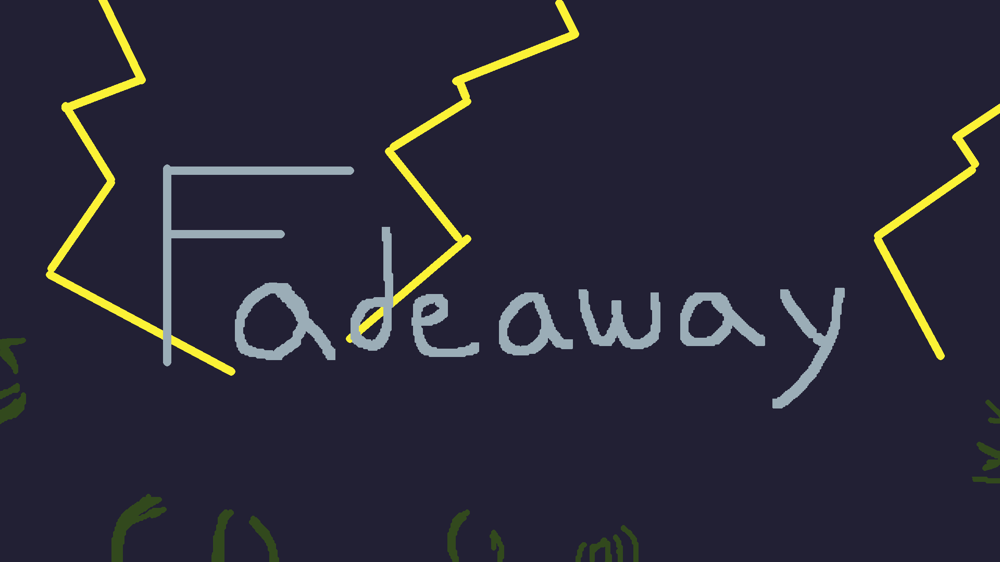

# 🧟‍♂️ Fadeaway Reboot

4-player co-op zombie survival game where you try to rack up the kills, and see who the last player standing is. The catch? You can't see in the night... except for when lightning strikes!

The [original game](https://github.com/SunnyNagam/Fadeway) by [Sunny Nagam](https://sunnynagam.github.io/) won 2017's Cobresun Game Jam and was a ton of fun, so Cobresun attempted a more [modern remake](https://github.com/Cobresun/Fadeaway) in 2020 which was good but we didn't pursue further.
I thought it could be fun to take the concept and bring it to multiplayer and this is the result!

[itch.io page](https://brian-norman.itch.io/fadeaway) to go download this game!

## Screenshot

